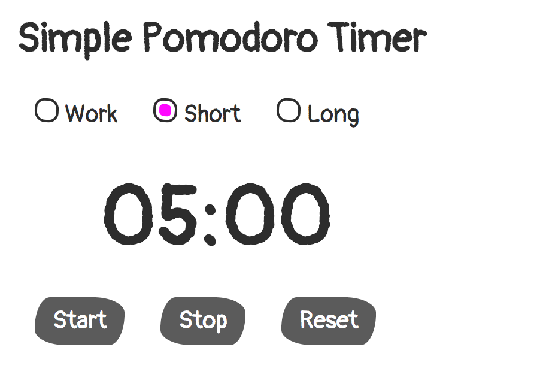

# React Example - Pomodoro Timer🍅⏱

It is a simple timer for [Pomodoro technique](https://en.wikipedia.org/wiki/Pomodoro_Technique).

It's build on top of [create-react-app](https://github.com/facebook/create-react-app).

## Demo
[demo]()

## Local development
### npm
`npm install` and `npm start`.

### yarn
`yarn` and `yarn start`.

## Dependency
### [Trashy.css](https://t7.github.io/trashy.css/)
I think that `Trashy.css` is a very simple and great CSS library.

### [sanitize.css](https://csstools.github.io/sanitize.css/)
`Trashy.css` needs `sanitize.css`.

## TODO
- [ ] Notification sound
- [ ] Unit tests

## License
The MIT License (MIT). Please see License File for more information.
